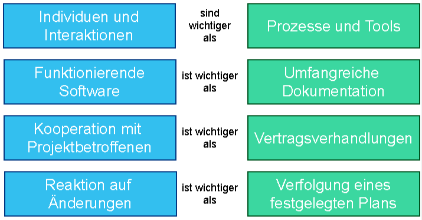

## Vorlesung 2: Vorgehensmodelle

### Wiederholung/Lernziele

### Vorgehensmodelle

### Von klassischen zu agilen Vorgehensmodellen

### Agile Vorgehensmodelle

#### Das agile Manifest

#### Grundwerte
* Kundenzufriedenheit durch flexible Reaktion auf Kundenwünsche
* **Face-to-Face** Kommunikation
* Zyklischer und inkrementeller Entwicklungsprozess
	* Früh und häufig ausführbare Software ausliefern
	* Software in regelmäßigen, kurzen Abständen dem Kunden präsentieren
	* Entwicklungsprozess möglichst leichtgewichtig gestalten
	* Passe den Prozess bei Bedarf an eine veränderte Umgebung an
	* Reduktion der Entwurfsphase auf ein Mindestmaß

#### Prinzipien
* Die wichtigen Dinge zuerst machen
	* Die Features mit dem höchsten Mehrwert zuerst realisieren
	* Geschäftswert = *f(Kosten, Zeit, Funktionalität, Qualität)*
* **KISS** = Keep it stupid simple
* **YAGNI** = You ain't gonna need it

#### Praktiken
* Kundeneinbindung und Kundenfeedback
* Regelmäßige Überprüfung und Verbesserung der eigenen Effektivität

#### Vergleich mit anderen Vorgehensmodellen
|| Bisheriger Ansatz | Agiler Ansatz
--- | --- | ---
**Mitwirkung des Kunden** | unwahrscheinlich | kritischer Erfolgsfaktor
**Etwas Nützliches wird geliefert** | erst nach einiger (längerer) Zeit | mindestens alle sechs Wochen
**Das Richtige entwickeln durch** | langes Spezifizieren, Vorausdenken | Kern entwickeln, zeigen, verbessern
**Nötige Disziplin** | formal,  wenig | informell, viel
**Änderungen** | erzeugen Widerstand | werden erwartet und toleriert
**Kommunikation** | über Dokumente | zwischen Menschen
**Vorsorge für Änderungen** | durch Versuch der Vorausplanung | durch *flexibel bleiben*

### Zusammenfassung