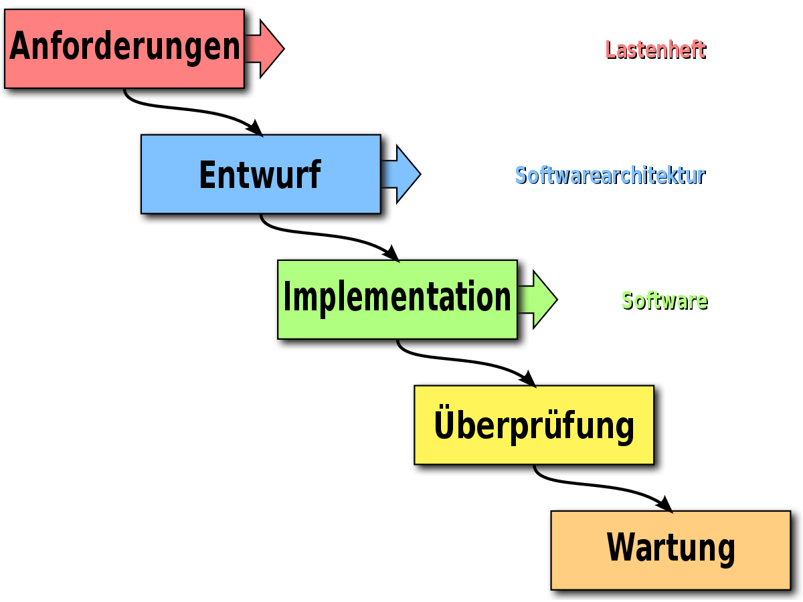
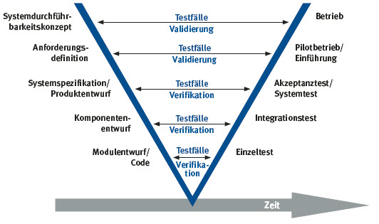

## Vorlesung 2: Vorgehensmodelle

### Wiederholung/Lernziele

### Vorgehensmodelle

#### Systemanalyse
* Ziel: Verstehen des Problems und des realisierenden Systems
* Untursuchung der technischen und ökonomischen Durchführbarkeit
* Beschreibung der ablauffähigen Vorgänge
* Graphische Darstellung des Problems in Systemmodellen
* Zerlegung des Problems in Teilprobleme

Das Ergebnis daraus: Systemmodell

#### Softwareentwurf 
* Planung von Form und Struktur der Lösung.
* Beschreibung der Beziehung der Vorgänge untereinander
* Beschreibung der Beziehung zur Umwelt (externe Ereignisse, externe Schnittstellen)
* Muss die in der Anforderungsspezifikation definierten Anforderungen erfüllen

Das Ergebnis daraus: Entwurfsspezifikation

#### Implementierung
* Umsetzung der Entwurfsspezifikation in einer Programmiersprache + Dokumentation
* Entwickertests

Das Ergebnis daraus: Programmcode, Dokumentation, Tests

#### Test
* Integrationstest
    * Überprüfung des Gesamtsystems gegen die Entwurfsspezifikation
    * Testen umd Fehlerzustände in den Schnittstellen und den zu integrierenden Komponenten aufzudecken.
* Systemtest
    * Überprüfung des Gesamtsystems gegen die Anforderungen
    * Testen eines integrierten Systems
    * Leistungsmessungen und Optimierungen

Testergebnisse: Testspezifikation und Testprotokolle

#### Wartung und Weiterentwicklung
* Wartungsaufgaben
    * Beseitigung aufgetretener Fehler
    * Optimierung
    * Anpassung an neue Anforderungen
    * Austausch von Teilen des Gerätesystems

Ergebnis: Protokolle für das Monitoring von Systemzuständen sowie verbessertes Softwareprodukt

#### Bekannte Vorgehensmodelle
* Wasserfall-Modell
* V-Modell
* Agile Vorgehensmodelle

#### Wasserfallmodell 
* Weiterentwicklung des "Phasenmodells"
* Jede Phase muss vollständig durchgelaufen werden.
* Streng sequentiell. Nächste Phase beginnt erst nach Abschluss der vorigen Phase
* Iterationen sind nur zwischen zwei aufeinanderfolgenden Phasen erlaubt.
* Aus jeder Phase entstehen Dokumente, die abgenommen werden.

##### Vorteile
* Einfach verständlich, kein großter Schulungsaufwand nötig
* Begrenzter Managementaufwand
* Sehr strukturierter und kontrollierbarer Prozessablauf

##### Nachteile
* In der Praxis sind Überlappungen der Phasen notwendig
* Annahme, dass zu Beginn eine abgeschlossene und korrekte Anforderungsdefinition existiert, entspricht nicht der Realität
* Lauffähige Version des Systems liegt erst am Ende der Entwicklung vor
* Auftraggeber ist nur in der ersten Phase (Anforderungsdefinition) mit eingebunden
* Nichteinhalten der Projektdauer führt zu Abstrichen in den späten Phasen
* Testen wird nur am Ende des Entwicklungszyklus vorgesehen

#### V-Modell
* Standard für den öffentlichen Bereich
* Definiert 25 Rollen für Managementaufgaben
* Anpassbarkeit auf konkrete Projektbedingungen
* Integriert die Qualitätssicherung mit in den Prozess
* Klare Zuordnung zwischen Entwicklungs- und Qualitätssicherung
* Das V-Modell gliedert den Entwicklungsprozess in drei Sichten:
    * Andersicht
    * Architektursicht
    * Implementierungssicht

##### Vorteile 
* Umfassendes Modell
* Integriert viele Aspekte des Entwicklungsprozess
* Erweiterbar und anpassbar

##### Nachteile
* Nicht für kleine Projekte geeignet
* Nicht für rasch ändernde Anforderungen geeignet

### Von klassischen zu agilen Vorgehensmodellen

### Agile Vorgehensmodelle

#### Das agile Manifest

#### Grundwerte
* Kundenzufriedenheit durch flexible Reaktion auf Kundenwünsche
* **Face-to-Face** Kommunikation
* Zyklischer und inkrementeller Entwicklungsprozess
  * Früh und häufig ausführbare Software ausliefern
  * Software in regelmäßigen, kurzen Abständen dem Kunden präsentieren
  * Entwicklungsprozess möglichst leichtgewichtig gestalten
  * Passe den Prozess bei Bedarf an eine veränderte Umgebung an
  * Reduktion der Entwurfsphase auf ein Mindestmaß

#### Prinzipien
* Die wichtigen Dinge zuerst machen
  * Die Features mit dem höchsten Mehrwert zuerst realisieren
  * Geschäftswert = *f(Kosten, Zeit, Funktionalität, Qualität)*
* **KISS** = Keep it stupid simple
* **YAGNI** = You ain't gonna need it

#### Praktiken
* Kundeneinbindung und Kundenfeedback
* Regelmäßige Überprüfung und Verbesserung der eigenen Effektivität

#### Vergleich mit anderen Vorgehensmodellen
|| Bisheriger Ansatz | Agiler Ansatz |
| --- | --- | --- |
| **Mitwirkung des Kunden** | unwahrscheinlich | kritischer Erfolgsfaktor |
| **Etwas Nützliches wird geliefert** | erst nach einiger (längerer) Zeit | mindestens alle sechs Wochen |
| **Das Richtige entwickeln durch** | langes Spezifizieren, Vorausdenken | Kern entwickeln, zeigen, verbessern |
| **Nötige Disziplin** | formal,  wenig | informell, viel |
| **Änderungen** | erzeugen Widerstand | werden erwartet und toleriert |
| **Kommunikation** | über Dokumente | zwischen Menschen |
| **Vorsorge für Änderungen** | durch Versuch der Vorausplanung | durch *flexibel bleiben* |

### Zusammenfassung