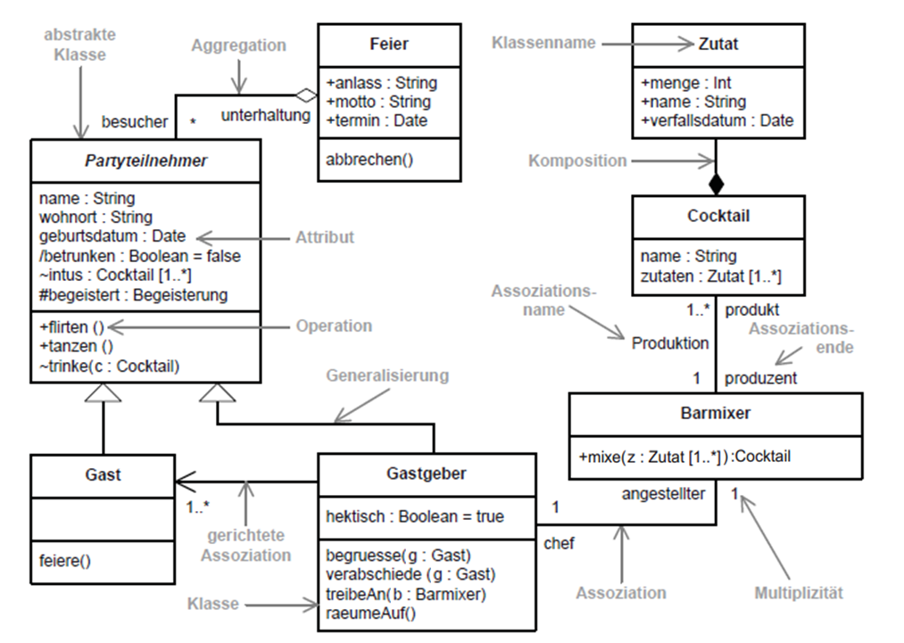
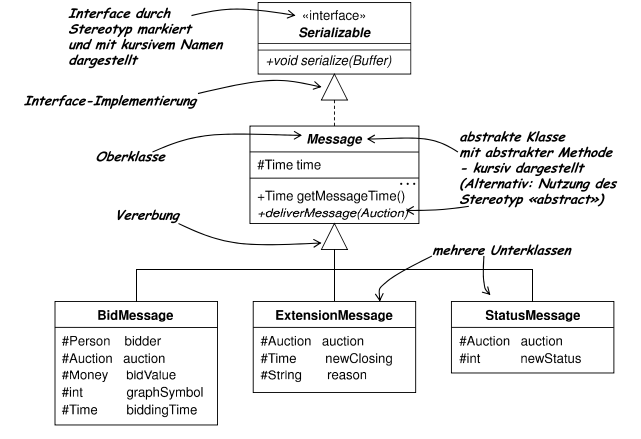
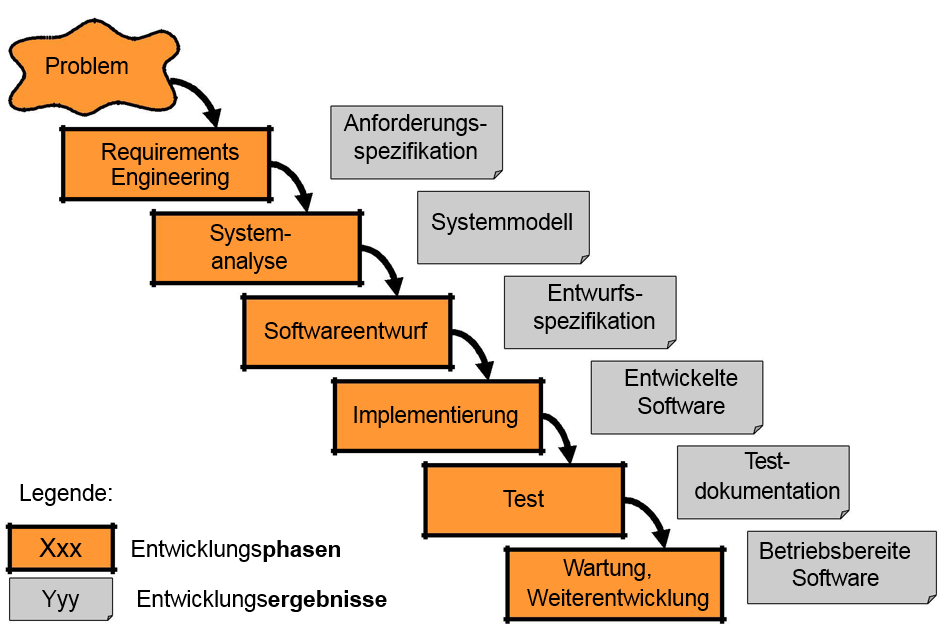
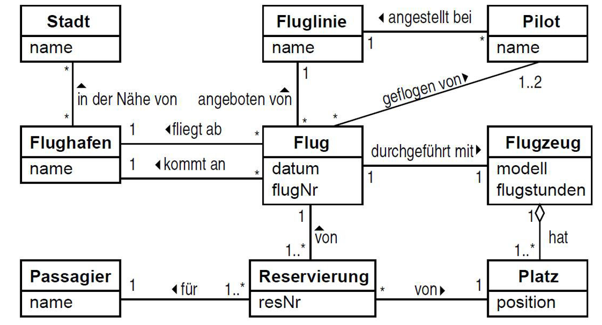

## Vorlesung 8: Systemanalyse mit Analyseklassendiagrammen

### Lernziele

- Klassendiagramme mit UML modellieren können
- Analyseklassendiagramme aus Anforderungen ableiten können
- Ermitteln von Klassen, Attributen und Beziehungen fürAnalyseklassendiagramme

### Klassendiagramme

#### Sichtbarkeit
Definiert die Sichtbarkeit des Attributes fürandere Elemente

- Beispielfür berechnetes Attribut: Klasse mit Attribut für Preis. Abgeleitetes Attribut: Preis mit Mehrwertsteuer.
- Keine Angabe der Sichtbarkeit = default. Default = package.
- Statische Attribute & Methoden sind unterstrichen
- Abstrakte Methoden und Klassen sind kursiv

#### Generalisierung und Spezialisierung

**Hinweis:** Mehrfacherbung ist in UML zulässig

#### Stereotypen
- Ein Stereotypklassifiziert Modellelemente wie Klassen oder Attribute.
- Durch einen Stereotyp wird die Bedeutung des  Modellelements spezialisiert  und kann so beispielsweise bei der Codegenerierung spezifischer behandelt werden.

#### Merkmale
- Ein Merkmal wird normalerweise in der Form {name = wert} notiert
- {abstract} = {abstract = true}
- Eigene Merkmale können für Klassen und Attribute definiert werden

#### Verantwortlichkeiten
- Ein Vertrag oder eine Verpflichtung einer Klasse, einen bestimmten Dienst auszuführen
- Verantwortlichkeiten stehen im Klassendiagramm bei einer Klasse unter den Operationen
- Werden selten verwendet

### Assoziationen

### Logisch-statische Sicht auf ein Softwaresystem mit Analyseklassendiagrammen in der Systemanalyse

#### Einordnung in den Entwicklungsprozess

&nbsp;

&nbsp;

- Beschreibung der Anwendungsfälle -> Anforderungsanalyse.
- Beschreibung der Akteure -> Anforderungsanalyse.
- Spezifikation der Geschäftsvorfälle mit Text -> Anforderungsanalyse.
- Spezifikation der Abläufe (z.B. Geschäftsvorfälle) mit Aktivitätsdiagrammen -> Letze Vorlesung.
- Ermitteln von Analyseklassendiagramm mit Klassen, Attribute und Beziehungen und Methoden -> Heute.

&nbsp;

&nbsp;

#### Das Domain Object Model(=Analyseklassendiagramm)

- illustriert wichtige Konzepte der realen Welt und deren Beziehungen der Anwendungsdomäne
- ist ein Modell von realen Konzepten und nicht von Software Komponenten, weil es „Dinge“ aus der realen Welt beschreibt und daher keine Beschreibung eines Software Designs ist
- besteht aus statischen Elementen, in denen manchmal Attribute, aber keine Methoden definiert werden

&nbsp;

&nbsp;

#### Strategien, um Klassen für Analyseklassendiagramm zu finden:

1. Substantivmethode
2. CRC-Methode (Class, Responsibility, Collaboration)

- In der Vorlesung wird die Substantivmethode betrachtet,
    - Dabei werden die Klassen auch durch Analyse des Glossars gefunden
    - Beispiel für ein Glossar:

**Benutzer**  
&nbsp;&nbsp;&nbsp;&nbsp;&nbsp; Angemeldeter „Kunde“ mit Account  
**Account**  
&nbsp;&nbsp;&nbsp;&nbsp;&nbsp; Bei der Registrierung wird für den „Kunden“ ein „Account“ angelegt, der ihn identifiziert  
**Profil**  
&nbsp;&nbsp;&nbsp;&nbsp;&nbsp; Persönliche Seite, die ein Benutzer für sich anlegen kann/muss.  
**Postfach**  
&nbsp;&nbsp;&nbsp;&nbsp;&nbsp; Jeder Account verfügt über ein Postfach zum Empfangen und Senden von Nachrichten.  
**Präferenzen**  
&nbsp;&nbsp;&nbsp;&nbsp;&nbsp; Eine Liste von Vorlieben, die ein Benutzer für die Suche nach anderen Benutzern anlegt.  
**Präferenzliste**  
&nbsp;&nbsp;&nbsp;&nbsp;&nbsp; Eine vom System bereitgestellte Liste, die auf die Präferenzen des Benutzers zutreffende andere Benutzer anzeigt.  
**Vorschläge**  
&nbsp;&nbsp;&nbsp;&nbsp;&nbsp; Eine vom System bereitgestellte Liste mit möglicherweise für den Benutzer interessanten anderen Benutzern.  
**Freunde**  
&nbsp;&nbsp;&nbsp;&nbsp;&nbsp; Andere Benutzer, die der Benutzer als Freunde deklariert hat.  
**Freundesliste**  
&nbsp;&nbsp;&nbsp;&nbsp;&nbsp; Eine Liste aller „Freunde“ des Benutzers  
**Admin**  
&nbsp;&nbsp;&nbsp;&nbsp;&nbsp; Jemand der administrative Arbeiten am System durchführt.  
**Fakeuser**  
&nbsp;&nbsp;&nbsp;&nbsp;&nbsp; Eine Art Super-Admin, der mehrere Benutzer löschen und beliebig viele Postfächer einsehen kann.  

#### Analyseklassendiagramme - Konstruktion

- Grammatische Analyse anhand von Beschreibungen (Glossar, Use-Cases-Beschreibungen, sonstige Dokumente) des zu erstellenden Systems in natürlicher Sprache

##### Finden von
- Klassen
- Attribute
- Assoziation
- Vererbung
- (Operationen)

#### Klassen

- Text der Anforderungen ist Grundlage zum Finden erster Klassen
- Substantive in Anforderungen und Glossar ansehen
- Substantive können Klassen oder Attribute sein

1. Substantive, die komplexe Dinge mit wichtigen Eigenschaften und Fähigkeiten beschreiben, werden als Klassen abgebildet 
    - Personen, Gegenstände, komplexe Vorgänge (z. B. Bestellung)
2. Substantive, die einfach strukturierte Dinge mit nur einer vorherrschenden Eigenschaft beschreiben, werden als Attribute abgebildet
    - Name einer Person, Farbe eines Gegenstandes, Datum einer Bestellung

#### Instanzvariablen und Methoden

- Adjektive können auf Eigenschaften hindeuten -> Instanzvariablen
- Verben können auf Operationen hinweisen
- Wähle geeignete Datentyp für Instanzvariablen
  - Bei komplexen Instanzvariablen kann man auch Klassen als Typ verwenden

- Fehlerquellen
  - Instanzvariablen beschreibt Implementierungs- und Entwurfsdetails
  - Methoden oder Instanzvariablen enthalten keine Sichtbarkeiten

- Anmerkung: Im zu analysierenden Text können auch Objekte identifiziert werden, die zur Veranschaulichung in einem Objektdiagramm dargestellt werden können.

#### Assoziation

- Welche Kardinalität haben die beteiligten Klassen?
- Welche Rollen spielen die beteiligten Klassen?
- Richtung und Navigierbarkeit beachten
- Assoziationen und Rollen benennen
- Welche Art von Beziehung (Aggregation oder Komposition) liegt vor?
- Kardinalitäten 1..* oder 0..*?

#### Vererbung

- Wenn Objekte verschiedener Klassen große Gemeinsamkeiten haben, kann Vererbung genutzt werden
- Aus gleichartigen Klassen eine neue Oberklasse bilden
- Prüfen auf eine gute Vererbung
  - Wird das Verständnis des Modells verbessert?
  - Liegt eine „is-a“-Beziehung vor?
  - Maximal drei bis fünf Hierarchiestufen
  - Überlegen, ob Komposition oder Vererbung sinnvoll ist

### Best Practices

- Weniger ist mehr: nur das Notwendige. Verständlich für den Auftraggeber
- Gute Analysenklassendiagramme besitzen folgende Merkmale:
  - Klassen repräsentieren die fachlichen Konzepte der Anwendungsdomäne
  - Keine Entwurfs- oder Implementierungsdetails
  - Nicht aus jedem Detail eine Klasse modellieren
- Aussagefähige Klassenname: Substantiv im Singular
- Keine überkreuzenden Assoziationslinien
- Orthogonalität: Nur gerade (horizontal, vertikal) Assoziationslinien
- Oberklassen nach oben
- Fachlich hängt die grafische Benutzeroberfläche (GUI, Graphical User Interface) eng mit dem unterliegendem Geschäftsklassenmodell zusammen
- Möglicher Ansatz: „Mache alle Objekte an der Oberfläche sichtbar, die ein Nutzer ändern oder für dessen Inhalte er sich interessieren kann.“

### Beispiel
