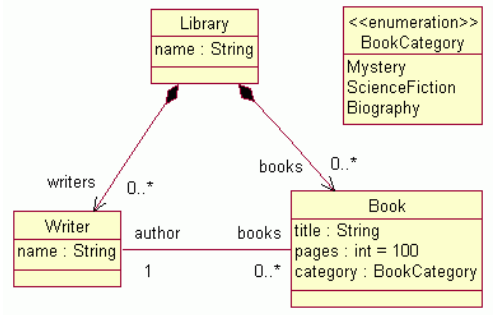
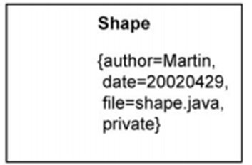

## Vorlesung 8: Systemanalyse mit Analyseklassendiagrammen

### Lernziele

- Klassendiagramme mit UML modellieren können
- Analyseklassendiagramme aus Anforderungen ableiten können
- Ermitteln von Klassen, Attributen und Beziehungen fürAnalyseklassendiagramme

### Klassendiagramme

#### Sichtbarkeit
Definiert die Sichtbarkeit des Attributes fürandere Elemente

- Beispielfür berechnetes Attribut: Klasse mit Attribut für Preis. Abgeleitetes Attribut: Preis mit Mehrwertsteuer.
- Keine Angabe der Sichtbarkeit = default. Default = package.
- Statische Attribute & Methoden sind unterstrichen
- Abstrakte Methoden und Klassen sind kursiv

#### Generalisierung und Spezialisierung

**Hinweis:** Mehrfacherbung ist in UML zulässig

#### Stereotypen
- Ein Stereotypklassifiziert Modellelemente wie Klassen oder Attribute.
- Durch einen Stereotyp wird die Bedeutung des  Modellelements spezialisiert  und kann so beispielsweise bei der Codegenerierung spezifischer behandelt werden.

#### Merkmale
- Ein Merkmal wird normalerweise in der Form {name = wert} notiert
- {abstract} = {abstract = true}
- Eigene Merkmale können für Klassen und Attribute definiert werden

#### Verantwortlichkeiten
- Ein Vertrag oder eine Verpflichtung einer Klasse, einen bestimmten Dienst auszuführen
- Verantwortlichkeiten stehen im Klassendiagramm bei einer Klasse unter den Operationen
- Werden selten verwendet

### Assoziationen

#### Arten von Assoziationen

Eine Modellierung der Assoziationen zeigt die Zusammenhänge zwischen Objekten von Klasse. Wichtig dabei ist, dass sich alle Assoziationen 
außer der Vererbung auf Objekte bezieht und nicht auf deren Klassen.

#### Navigierbarkeit

Die Art der Assoziation bestimmt die Richtung, in der die Objekte miteinander interagieren.

#### Kardinalität (= Multiplizität)

Definiert die Anzahl der Instanzen, die unter diesem Attribut abgelegt werden können.

##### Kardinalität
* Anzahl der Objekte in einer Beziehung

##### Assoziationsname
* Optionaler Name der Assoziation

##### Rolle
* Definition der Verwendung einer Klasse
* Beispiel:
    * Ein Dozent ist ein Lehrer und ein Seminar wird als Vorlesung abgehalten
* Kardinalität sagt:
    * Ein Dozent kann 0 oder mehr Seminare als Form einer Vorlesung halten
    * Ein Seminar wird von einem oder mehr Dozenten gehalten werden

#### Rollenname

#### Assoziationen mit xor-Einschränkung

#### Assoziationsklassen

#### Aggregation
* eine Aggregation stellt eine schwache Beziehung zwischen dem "Ganzen" und einem "Teil" dar
* die Navigierbarkeit geht nur in die Richtug "Ganz" -> "Teil"
* keine Einschränkung der Multiplizität
    * Angabe der Multiplizität ist beliebig möglich
    * ein "Teil" kann in mehreren "Ganzen" vorhanden sein
    * bei keiner Angabe der Multiplizität wird sie auf "1" gesetzt

* In dem Beispiel hat ein Auto einen Motor, der Motor kann aber ausgetauscht werden. Das Auto wird als "Ganzes" gesehen, der Motor als "Teil", kann aber ohne das Ganze existieren

#### Komposition
* eine Komposition stellt eine starke Beziehung zwischen einem "Ganzen" und einem "Teil" dar
    * diese Assoziation ist "untrennbar"
* bei der Zerstörung des Ganzen, wird das Teil auch zerstört
    * das Zeil kann ohne dem Ganzen nicht existieren
* die Navigierbarkeit geht nur in die Richtung "Ganz" -> "Teil"
* die Multiplizität ist beschränkt
    * ein Ganzes kann belibig viele Teile haben
    * ein Teil kann zur zu einem Ganzen gehören
    * die Erlaubten Multiplizitäten sind 0, 0..1, 1
    * bei keiner Angabe wird die Multiplizität auf 1 gesetzt

#### Zusammenfassende Tabelle für UML-Klassendiagramme

### Logisch-statische Sicht auf ein Softwaresystem mit Analyseklassendiagrammen in der Systemanalyse

### Best Practices

### Beispiel